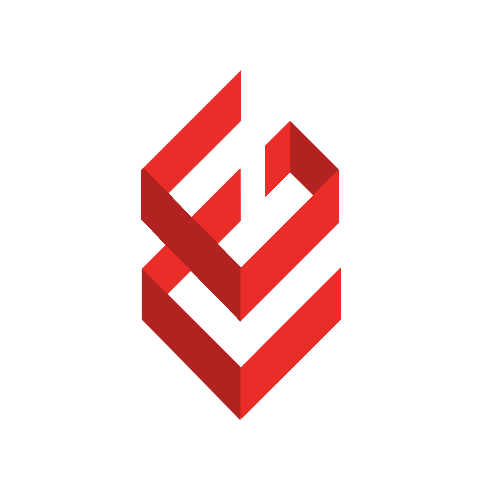

    
    
    
    
    
    

<h6 align="center">
</h6>
<h2 align="center">Asansol Engineering College Coding Club</h2>
<h1 align="center"><code>&nbsp;AECCC Community Website&nbsp;</code></h1>
This is the student-run community site and event management webapp for the Coding Club of Asansol Engineering College using ReactJS framework and MongoDB.

 

# 💻 Getting started

This project was bootstrapped with Create React App. In the [`Frontend`](./Frontend) directory, run `npm install` to install all project dependencies. Next, run `npm start` to start the developmental server which will trigger open your default browser to `localhost:3000`.

 

# ⚒️ Tools and Frameworks

<h6 align="center">      </h6>

 

# ✨ Contributing

By contributing to this repository, you adhere to the rules in our [Code of Conduct](./.github/CODE_OF_CONDUCT.md). Here are a few general instructions for people willing to develop onto the codebase.

### • Create issues to discuss your ideas with the maintainers

Creating issues before starting to work on your pull request helps you stay on the right track. Discuss your proposal well with the current maintainers.

### • Keep the code clean

AECCC members will read your code long after you've graduated. Don't hurt their eyes. Follow the code formatting standards of the repository by referring to existing source files.

### • Comments are the best

Make it clear what hacks you've used to keep this website afloat. Your work needs to be understood first, before getting appreciated (or criticised).

### • Keep the Contributors section up-to-date

Just so that everyone knows whose fault it is if things get screwed up.

 

# 👨‍💻 Our valuable Contributors

This project is made possible by our valuable contributors .Thanks to all the **People Who Contribute**.

 

# Repository structure

Prettyprinted ASCII project directory tree in [`docs/TREE.md`](./docs/TREE.md)

 

# 📜 License

[`MIT License`](./LICENSE) Copyright (c) 2022 AEC Coding Club
